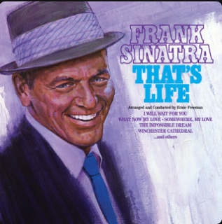

```{r setup, include=FALSE}
knitr::opts_chunk$set(echo = FALSE)

library(flexdashboard)
library(tidyverse)
library(usethis)
library(spotifyr)
library(compmus)
library(plotly)
library(gridExtra)
library(cowplot)
```

Novelty 
=====================================

Column {data-width=600}
-----------------------------------------------------------------------
```{r data tempograms}
margerita <-
  get_tidy_audio_analysis("6TFUhEcEsqGVMZeZtAeUzN") |>
  select(segments) |>
  unnest(segments)

sway <-
  get_tidy_audio_analysis("2ajUl8lBLAXOXNpG4NEPMz") |>
  select(segments) |>
  unnest(segments)
```

###  Original Piece

```{r tempograms, fig.width=15}
sway |>
  mutate(loudness_max_time = start + loudness_max_time) |>
  arrange(loudness_max_time) |>
  mutate(delta_loudness = loudness_max - lag(loudness_max)) |>
  ggplot(aes(x = loudness_max_time, y = pmax(0, delta_loudness))) +
  geom_line() +
  xlim(0, 30) +
  ylim(0, 25) +
  theme_minimal() +
  labs(x = "Time (s)", y = "Novelty", title= "Sway - Michael Buble")
```

### Same song in a different context

```{r, fig.width=15}
margerita |>
  mutate(loudness_max_time = start + loudness_max_time) |>
  arrange(loudness_max_time) |>
  mutate(delta_loudness = loudness_max - lag(loudness_max)) |>
  ggplot(aes(x = loudness_max_time, y = pmax(0, delta_loudness))) +
  geom_line() +
  xlim(0, 30) +
  ylim(0, 25) +
  theme_minimal() +
  labs(x = "Time (s)", y = "Novelty", title="Spicey Margerita - Michael Buble & Jason Derulo")
```


Column {.sidebar data-width=400}
-----------------------------------------------------------------------
On this tab is visualized the novelty of two songs within the repertoire of Micheal Buble.
What I like about this visualization is that it shows how Buble is not afraid to 
revolutionise its own songs into a new, more pop style context. Let me explain.

The top plot shows the novelty of the song "Sway" which is your classic jazzy styled song of Buble and was brought out around november of 2014.
As can be seen the novelty is not very high during any point during the song and caps at around 10
which for me is complementary to the jazz genre. 

The second plot show the novelty of the song "spicy Margerita" and when you listen to this song
you realise that it is an renovation of the previously mentioned track. The same sort of sounds are used but within a 
different context. Spicey Margerita is more modern than its previous counterpart and more of the pop genre instead of jazz. The song is more fast paced and more structurely rythmic. As a result the novelty of this song has higher spikes of around 13 and the spikes occur more often, which fits to the more modern aproach of the song. 


Corpus {data-orientation=rows}
=====================================

Row {data-height=600}
-----------------------------------------------------------------------

### Description 
I have chosen a corpus containing in total 120 tracks (could become more in the future). The foundation of the corpus exists of two playlists combined, supplemented with around twenty tracks. The two playlists I used were the "This is Michael Buble" and the "This is Frank Sinatra" playlists. In other words JAZZZZZ. When you've listened to Buble before you may be familliar with the fact that Buble has many covers in his audiography. A lot of covers are also songs of Sinatra. I'm interested to see if there are any similarities between the two artists or that Buble reinvented the songs by giving his own twist to the lyrics.

My natural groups of comparison points in my corpus are (of course) the artists and their genres. I am gonna try to think of a few more comparison points but for now i will stick to these two. I expect that there will be a lot of similarities between the two artists, but at the same time i expect there to be different interpretations of the same songs by the two artists.

I think my corpus is generally representative of the points I want to compare. Because of the amount of covers Buble has produced in his career there are a lot of songs to compare. However, I do think there are a healthy amount of outliers with respect to the songs of Buble, because not ALL his songs are of the genre Jazz.

A track I think is typical in my corpus is the classic: Fly me to the moon. There are an unthinkable amount of covers made of this song. I am excited to research the similarities or differences the artists made during their interpretation of this song.

### Buble
```{r, echo = F, fig.width=6, fig.height=6}

```

Row {data-height=400}
-----------------------------------------------------------------------

### Sinatra
```{r, echo = F, fig.width=10, fig.height=6}

```

### van Aarsen
```{r, echo = F, fig.width=10, fig.height=6}
knitr::include_graphics("images/dennis.png")
```

### Preslee
```{r, echo = F, fig.width=10, fig.height=6}

```


Danceability
=====================================

Column {data-width=600}
-----------------------------------------------------------------------

### Did Buble make the genre more danceable?

```{r, echo = FALSE}
# import of corpus
jazz <- get_playlist_audio_features("", "6W4qNJv2ViwlCElxMIK24H")
MB <- get_playlist_audio_features("", "37i9dQZF1DZ06evO0WqnZe")
FS <- get_playlist_audio_features("", "37i9dQZF1DZ06evO102dNu")
combined <- rbind(MB, FS)

scatter <- ggplot(combined, aes(x=valence, y=danceability, color=playlist_name)) +
  geom_point() +
  geom_smooth(se=FALSE, linewidth = 0.5) +
  expand_limits(x=0, y=0) +
  labs(x="Valence", y="Danceability")

ggplotly(scatter) %>%
  layout(legend = list(x=0.7, y=0.1))
```

Column {.sidebar data-width=400}
-----------------------------------------------------------------------
I have made a scatterplot with on the x axis all the valence values of the tracks that are present in the "This is Frank Sinatra" and "This is Micheal Buble" playlists. On the y axis i have plotted al the danceability values of the same tracks. For the color of the dots I have used the album of the artist who sang the song. This makes it clear which dot belongs to which artist. 

I think this plot is interesting because it is actually in line with what I thought about the artist before making the plot. In the plot it can be seen that Buble in general scores higher in the danceability scores than Sinatra. My thoughts about the bibliograhpy of Buble were that he has a lot covers from Sinatra and next to those covers he has more hip hop styled songs. I think that these thoughts are well represented in this plot.


Same songs
=====================================

Column {.sidebar data-width=400}
-----------------------------------------------------------------------
On this next tab on the right I used a technique called Dynamic Time Warping (DTW)
to show how buble made cover of the well known classic of a song "Fly me to the moon"

When you look closely to the plot there is a dark diagonal line through the plot. 
I admit it is not very visible but there really is one. By this line we can see how similar the 
two songs really are. For explanation, a very straight line correlates to a close similarity between the songs. 
The same for the opposite. A very skewed line represents many differences between the songs. 

Because in this plot on the right we can see that the line is mostly straight with some exceptions here and there.
For example around 80 seconds into te song we can see that the line skewes a little bit upwards, which indicates that the version of Buble is a tiny bit slower when compared to the original of Sinatra. Overall we can conclude that Buble does a good job to stay within the same structures of the original pieces during his covers. 


Column {data-width=600}
-----------------------------------------------------------------------

### Same song, roughly the same interpretation

```{r DTW, fig.width=20, fig.height=12}
sinatra <-
  get_tidy_audio_analysis("7FXj7Qg3YorUxdrzvrcY25") |>
  select(segments) |>
  unnest(segments) |>
  select(start, duration, pitches)

buble <-
  get_tidy_audio_analysis("7rqSxhVpV4uSKI6WBuToC7") |>
  select(segments) |>
  unnest(segments) |>
  select(start, duration, pitches)

compmus_long_distance(
  sinatra |> mutate(pitches = map(pitches, compmus_normalise, "euclidean")),
  buble |> mutate(pitches = map(pitches, compmus_normalise, "euclidean")),
  feature = pitches,
  method = "cosine"
) |>
  ggplot(
    aes(
      x = xstart + xduration / 2,
      width = xduration,
      y = ystart + yduration / 2,
      height = yduration,
      fill = d
    )
  ) +
  geom_tile() +
  coord_equal() +
  labs(x = "Sinatra", y = "Buble", title = "'Fly me to the moon' by two artits") +
  theme_minimal() +
  theme(plot.title = element_text(hjust = 0.5, size=25), axis.title = element_text(size=20)) +
  scale_fill_viridis_c(guide = NULL)
```

Cepstrograms
=====================================
```{r data ss and cepstogram}
sinatra_ss <-
  get_tidy_audio_analysis("4FmCUATNIarCQh72JYdvnm") |> # Change URI.
  compmus_align(sections, segments) |>                     # Change `bars`
  select(sections) |>                                      #   in all three
  unnest(sections) |>                                      #   of these lines.
  mutate(
    pitches =
      map(segments,
        compmus_summarise, pitches,
        method = "rms", norm = "euclidean"              # Change summary & norm.
      )
  ) |>
  mutate(
    timbre =
      map(segments,
        compmus_summarise, timbre,
        method = "rms", norm = "euclidean"              # Change summary & norm.
      )
  )

buble_ss <-
  get_tidy_audio_analysis("7wgYqjzA3qJLpyz89IlVPA") |> # Change URI.
  compmus_align(sections, segments) |>                     # Change `bars`
  select(sections) |>                                      #   in all three
  unnest(sections) |>                                      #   of these lines.
  mutate(
    pitches =
      map(segments,
        compmus_summarise, pitches,
        method = "rms", norm = "euclidean"              # Change summary & norm.
      )
  ) |>
  mutate(
    timbre =
      map(segments,
        compmus_summarise, timbre,
        method = "rms", norm = "euclidean"              # Change summary & norm.
      )
  )

dennis_ss <-
  get_tidy_audio_analysis("2Eq65QUisMmXt5StcQCMij") |> # Change URI.
  compmus_align(sections, segments) |>                     # Change `bars`
  select(sections) |>                                      #   in all three
  unnest(sections) |>                                      #   of these lines.
  mutate(
    pitches =
      map(segments,
        compmus_summarise, pitches,
        method = "rms", norm = "euclidean"              # Change summary & norm.
      )
  ) |>
  mutate(
    timbre =
      map(segments,
        compmus_summarise, timbre,
        method = "rms", norm = "euclidean"              # Change summary & norm.
      )
  )
```

```{r  cepstogram}
sinatra_ss |>
 compmus_gather_timbre() |>
 ggplot(
   aes(
     x = start + duration / 2,
     width = duration,
     y = basis,
     fill = value
   )
 ) +
 geom_tile() +
 labs(x = "Time (s)", y = NULL, fill = "Magnitude", title="Cepstogram - That's Life") +
 scale_fill_viridis_c() +
 theme_classic() +
 theme(plot.title = element_text( size=20))

buble_ss |>
  compmus_gather_timbre() |>
  ggplot(
    aes(
      x = start + duration / 2,
      width = duration,
      y = basis,
      fill = value
    )
  ) +
  geom_tile() +
  labs(x = "Time (s)", y = NULL, fill = "Magnitude", title="Cepstogram - That's Life") +
  scale_fill_viridis_c() +
  theme_classic() +
  theme(plot.title = element_text( size=20))

dennis_ss |>
  compmus_gather_timbre() |>
  ggplot(
    aes(
      x = start + duration / 2,
      width = duration,
      y = basis,
      fill = value
    )
  ) +
  geom_tile() +
  labs(x = "Time (s)", y = NULL, fill = "Magnitude", title="Cepstogram - That's Life") +
  scale_fill_viridis_c() +
  theme_classic() +
  theme(plot.title = element_text( size=20))
```

Self similarity
=====================================

Column {.sidebar data-width=300}
-----------------------------------------------------------------------
For this plot we stay with the same classic, That's life. And again we are comparing the 
same three performances. The one of Sinatra, Buble and van Aarsen. 

What I find interesting to see is that although the songs have their differences, performance wise
and sound wise, the three iterations still follow the same structure. The song start in a low tuned style where the 
first verse, chorus and second verse are sung. The songs are followed up by higher pitched  vocals which can be seen in the Chroma matrices. Also noticable to see is that the three performances all end with the iconic ending of "I'm gonna roll myself up in a big ball, and die" where the "die" part is very streched out. If you look on the top right of the plots they all show this part very well. 

When we look at the timbre matrices of the plot we can also see some differences. Specially between the versions of 
Buble and Sinatra. For context, Sinatra is singing the song for the most part on his own with here and there some 
background singers. Buble on the other hand is singing some parts of the song with a whole choir behind him singing with him. You can see this especially around 20 to 100 seconds. Where the sections alternate between Buble singing on his own and the choir backing him up. This pattern repeat itself at the end of the song from around 210 seconds. The timbre matrices visiualise this difference with Sintra his performance which was more consistent throughout the song. 

Column {.tabset data-width=700}
-----------------------------------------------------------------------

### Sinatra

```{r, fig.height=4, fig.width=5}
sinatra_ss_plot1 <- sinatra_ss |>
  compmus_self_similarity(pitches, "cosine") |> 
  ggplot(
    aes(
      x = xstart + xduration / 2,
      width = xduration,
      y = ystart + yduration / 2,
      height = yduration,
      fill = d
    )
  ) +
  geom_tile() +
  coord_fixed() +
  scale_fill_viridis_c(guide = "none") +
  theme_classic() +
  labs(x = "", y = "", title = "Self Similarity Chroma Matrix - That's Life") +
  theme(plot.title = element_text( size=20))

sinatra_ss_plot2 <- sinatra_ss |>
  compmus_self_similarity(timbre, "cosine") |> 
  ggplot(
    aes(
      x = xstart + xduration / 2,
      width = xduration,
      y = ystart + yduration / 2,
      height = yduration,
      fill = d
    )
  ) +
  geom_tile() +
  coord_fixed() +
  scale_fill_viridis_c(guide = "none") +
  theme_classic() +
  labs(x = "", y = "", title = "Self Similarity Timbre Matrix - That's Life") +
  theme(plot.title = element_text( size=20))
```

```{r, fig.height = 7, fig.width=15}
plot_grid(sinatra_ss_plot1, sinatra_ss_plot2, ncol=2, nrow=1)
```


### Buble

```{r}
buble_ss_plot1 <- buble_ss |>
  compmus_self_similarity(pitches, "cosine") |> 
  ggplot(
    aes(
      x = xstart + xduration / 2,
      width = xduration,
      y = ystart + yduration / 2,
      height = yduration,
      fill = d
    )
  ) +
  geom_tile() +
  coord_fixed() +
  scale_fill_viridis_c(guide = "none") +
  theme_classic() +
  labs(x = "", y = "", title = "Self Similarity Chroma Matrix - That's Life") +
  theme(plot.title = element_text( size=20))

buble_ss_plot2 <- buble_ss |>
  compmus_self_similarity(timbre, "cosine") |> 
  ggplot(
    aes(
      x = xstart + xduration / 2,
      width = xduration,
      y = ystart + yduration / 2,
      height = yduration,
      fill = d
    )
  ) +
  geom_tile() +
  coord_fixed() +
  scale_fill_viridis_c(guide = "none") +
  theme_classic() +
  labs(x = "", y = "", title = "Self Similarity Timbre Matrix - That's Life") +
  theme(plot.title = element_text( size=20))
```

```{r, fig.height = 7, fig.width=15}
plot_grid(buble_ss_plot1, buble_ss_plot2, ncol=2, nrow=1)
```


### van Aarsen
```{r, self-similarity}
dennis_ss_plot1 <- dennis_ss |>
  compmus_self_similarity(pitches, "cosine") |> 
  ggplot(
    aes(
      x = xstart + xduration / 2,
      width = xduration,
      y = ystart + yduration / 2,
      height = yduration,
      fill = d
    )
  ) +
  geom_tile() +
  coord_fixed() +
  scale_fill_viridis_c(guide = "none") +
  theme_classic() +
  labs(x = "", y = "", title = "Self Similarity Chroma Matrix - That's Life") +
  theme(plot.title = element_text( size=20))

dennis_ss_plot2 <- dennis_ss |>
  compmus_self_similarity(timbre, "cosine") |> 
  ggplot(
    aes(
      x = xstart + xduration / 2,
      width = xduration,
      y = ystart + yduration / 2,
      height = yduration,
      fill = d
    )
  ) +
  geom_tile() +
  coord_fixed() +
  scale_fill_viridis_c(guide = "none") +
  theme_classic() +
  labs(x = "", y = "", title = "Self Similarity Timbre Matrix - That's Life") +
  theme(plot.title = element_text( size=20))
```

```{r, fig.height = 7, fig.width=15}
plot_grid(dennis_ss_plot1, dennis_ss_plot2, ncol=2, nrow=1)
```

Keygrams
=====================================

Column {.sidebar data-width=300}
-----------------------------------------------------------------------
For this plot I chose, in my opinion, another classic. The original song was brought in 1957
by the one and only Elvis Preslee. What I like about this song of Elvis is that it does not
really complement his signature Rock & Roll (-ish) style of music. The song is more 
comparable to the style of his song: "Can't help falling in love".  

When listening to the version of Elvis you can hear a very consistent use of chords being used.
I think Spotify does a good job in representing this consistent use of chords as can be seen in
the plot of Elvis. Most of the dark areas are around the chords: G major, E minor, C major and A minor. with some exceptions here and there. 

When comparing the two versions of Elvis and Buble there are some noticeable differences. First and foremost, Buble made his iteration of the song more sensitive and more in de direction to the jazz genre in combination with a overall slower pace. With this change the chords he used and the structure of the chords is a bit different to the version of Elvis.  

The difference in chords shows itself in the plot of Buble where it is very visible that the concentration of chords is heavily focused around the C major chord. Another differences are the small sections with different chords compared to the rest of the main parts. For example, around 30 to 35 seconds into the song there is the ending of the verse that's being sang in the beginning. This is performed by slowing the pace and switching to the A minor chord as can be seen in the plot. 


Column {data-width=700}
-----------------------------------------------------------------------

### Keygram
```{r data_keygrams}
circshift <- function(v, n) {
  if (n == 0) v else c(tail(v, n), head(v, -n))
}

#      C     C#    D     Eb    E     F     F#    G     Ab    A     Bb    B
major_chord <-
  c(   1,    0,    0,    0,    1,    0,    0,    1,    0,    0,    0,    0)
minor_chord <-
  c(   1,    0,    0,    1,    0,    0,    0,    1,    0,    0,    0,    0)
seventh_chord <-
  c(   1,    0,    0,    0,    1,    0,    0,    1,    0,    0,    1,    0)

major_key <-
  c(6.35, 2.23, 3.48, 2.33, 4.38, 4.09, 2.52, 5.19, 2.39, 3.66, 2.29, 2.88)
minor_key <-
  c(6.33, 2.68, 3.52, 5.38, 2.60, 3.53, 2.54, 4.75, 3.98, 2.69, 3.34, 3.17)

chord_templates <-
  tribble(
    ~name, ~template,
    "Gb:7", circshift(seventh_chord, 6),
    "Gb:maj", circshift(major_chord, 6),
    "Bb:min", circshift(minor_chord, 10),
    "Db:maj", circshift(major_chord, 1),
    "F:min", circshift(minor_chord, 5),
    "Ab:7", circshift(seventh_chord, 8),
    "Ab:maj", circshift(major_chord, 8),
    "C:min", circshift(minor_chord, 0),
    "Eb:7", circshift(seventh_chord, 3),
    "Eb:maj", circshift(major_chord, 3),
    "G:min", circshift(minor_chord, 7),
    "Bb:7", circshift(seventh_chord, 10),
    "Bb:maj", circshift(major_chord, 10),
    "D:min", circshift(minor_chord, 2),
    "F:7", circshift(seventh_chord, 5),
    "F:maj", circshift(major_chord, 5),
    "A:min", circshift(minor_chord, 9),
    "C:7", circshift(seventh_chord, 0),
    "C:maj", circshift(major_chord, 0),
    "E:min", circshift(minor_chord, 4),
    "G:7", circshift(seventh_chord, 7),
    "G:maj", circshift(major_chord, 7),
    "B:min", circshift(minor_chord, 11),
    "D:7", circshift(seventh_chord, 2),
    "D:maj", circshift(major_chord, 2),
    "F#:min", circshift(minor_chord, 6),
    "A:7", circshift(seventh_chord, 9),
    "A:maj", circshift(major_chord, 9),
    "C#:min", circshift(minor_chord, 1),
    "E:7", circshift(seventh_chord, 4),
    "E:maj", circshift(major_chord, 4),
    "G#:min", circshift(minor_chord, 8),
    "B:7", circshift(seventh_chord, 11),
    "B:maj", circshift(major_chord, 11),
    "D#:min", circshift(minor_chord, 3)
  )

key_templates <-
  tribble(
    ~name, ~template,
    "Gb:maj", circshift(major_key, 6),
    "Bb:min", circshift(minor_key, 10),
    "Db:maj", circshift(major_key, 1),
    "F:min", circshift(minor_key, 5),
    "Ab:maj", circshift(major_key, 8),
    "C:min", circshift(minor_key, 0),
    "Eb:maj", circshift(major_key, 3),
    "G:min", circshift(minor_key, 7),
    "Bb:maj", circshift(major_key, 10),
    "D:min", circshift(minor_key, 2),
    "F:maj", circshift(major_key, 5),
    "A:min", circshift(minor_key, 9),
    "C:maj", circshift(major_key, 0),
    "E:min", circshift(minor_key, 4),
    "G:maj", circshift(major_key, 7),
    "B:min", circshift(minor_key, 11),
    "D:maj", circshift(major_key, 2),
    "F#:min", circshift(minor_key, 6),
    "A:maj", circshift(major_key, 9),
    "C#:min", circshift(minor_key, 1),
    "E:maj", circshift(major_key, 4),
    "G#:min", circshift(minor_key, 8),
    "B:maj", circshift(major_key, 11),
    "D#:min", circshift(minor_key, 3)
  )
```

```{r plot_keygram, fig.width=18, fig.height=10}
buble_told <-
  get_tidy_audio_analysis("7EBAGLLkK2qdtwZ0l1bOnV") |>
  compmus_align(sections, segments) |>
  select(sections) |>
  unnest(sections) |>
  mutate(
    pitches =
      map(segments,
        compmus_summarise, pitches,
        method = "mean", norm = "manhattan"
      )
  )

preslee_told <- 
  get_tidy_audio_analysis("788AeYEaCvfFmuIHhb64Wn") |>
  compmus_align(sections, segments) |>
  select(sections) |>
  unnest(sections) |>
  mutate(
    pitches =
      map(segments,
        compmus_summarise, pitches,
        method = "mean", norm = "manhattan"
      )
  )

buble_plot_key <- buble_told |> 
  compmus_match_pitch_template(
    key_templates,         # Change to chord_templates if descired
    method = "euclidean",  # Try different distance metrics
    norm = "manhattan"     # Try different norms
  ) |>
  ggplot(
    aes(x = start + duration / 2, width = duration, y = name, fill = d)
  ) +
  geom_tile() +
  scale_fill_viridis_c(guide = "none") +
  theme_minimal() +
  labs(x = "Time (s)", y = "", title="Have I told you that I love you - Buble") +
  theme(plot.title = element_text(size=20), axis.title = element_text(size=16))

preslee_plot_key <- preslee_told |> 
  compmus_match_pitch_template(
    key_templates,         # Change to chord_templates if descired
    method = "euclidean",  # Try different distance metrics
    norm = "manhattan"     # Try different norms
  ) |>
  ggplot(
    aes(x = start + duration / 2, width = duration, y = name, fill = d)
  ) +
  geom_tile() +
  scale_fill_viridis_c(guide = "none") +
  theme_minimal() +
  labs(x = "Time (s)", y = "", title="Have I told you that I love you - Elvis") +
  theme(plot.title = element_text(size=20), axis.title = element_text(size=16))
```

```{r, fig.height = 7, fig.width=15}
plot_grid(buble_plot_key, preslee_plot_key, ncol=2, nrow=1)
```
